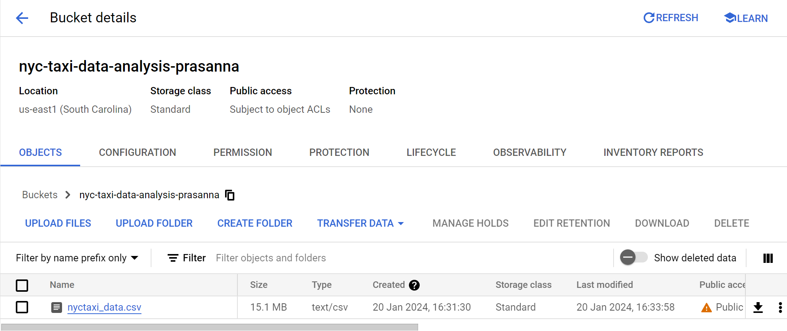
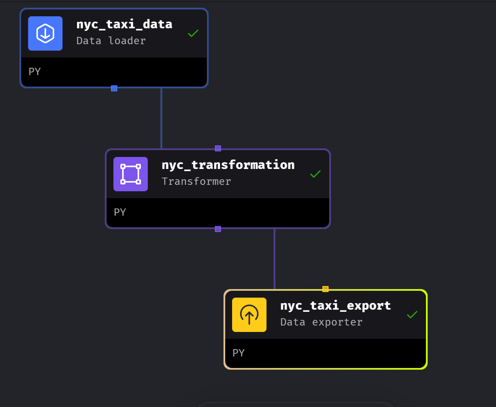
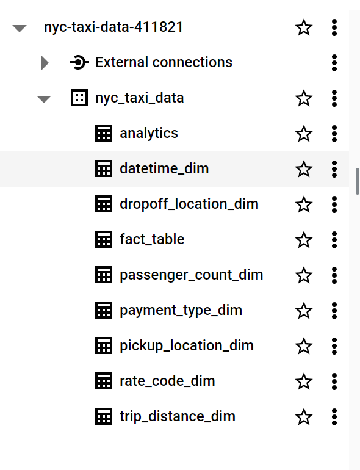

# NYCTaxiAnalysis
### An end to end data engineering and analysis project

In this project I build an end to end data engineering pipeline using Mage AI, Google Cloud Compute Engine and Google Cloud Big Query.

Mage AI is an open-source data pipeline tool for transforming and integrating data. I have used Mage to build, monitor and orchestrate the pipeline. The data (in .csv format) is extracted from Google Cloud Storage, transformed and then loaded into BigQuery.
Learn more about Mage AI [here](https://www.mage.ai/)

### Architecture

### Data Modeling
I start off by first creating a model of how the data is going to be stored in BigQuery. The input csv file contains 19 columns with info such as the VendorID, Pickup and drop time, pickup and drop locations, fare amount, tip amount, payment method etc. Following data modeling best practices I have split the data into fact and multiple dimension tables.
Learn more about data modeling concepts [here](https://www.ibm.com/docs/en/informix-servers/14.10?topic=model-concepts-dimensional-data-modeling)

### Data Model Diagram

Once the data model is created the data is ingested into Cloud Storage. I create a bucket and then upload the csv file into it, making sure the bucket has public access to ensure Mage can extract data from it (we can later setup access rules to prevent unauthorized access).

After this I spin up a VM instance in Google Cloud Compute Engine, install the necessary libraries including Mage AI and then begin creating the pipeline.
Below is the high level tree structure of the pipeline in Mage UI. You can see that it has a Data Loader, Transformer and Exporter. Mage makes it easy for us to connect different components of the data pipeline. It also makes it easy to acquire data from various popular sources such as AWS S3, Azure Blob, Google Cloud Storage, APIs etc as well as export data to popular destinations such as BigQuery, S3, Redshift etc. In addition we can also use Mage to setup triggers, monitor logs, and schedule runs.

### BigQuery
Once the pipeline is built, the data is then loaded into BigQuery in the form of fact and dimension tables, according to the data model.

I have then joined the various dimension and fact tables to create a new table called analytics. From here we can start building the dashboard.

### Dashboard
I have used LookerStudio to design and build the dashboard and you can view it [here](https://lookerstudio.google.com/reporting/1202517a-b496-4a8c-97fe-7b6e6a72f1c0).

Thank you so much for taking the time to go through my project and I hope you found it useful. Please feel free to reach out to me at prasannav710@gmail.com in case you require any clarifications, or if you have any feedback. Thanks again!
